#### 实验一：

##### 1.调查并记录实验环境的如下信息：

- 当前 Linux 发行版基本信息

  ```
  //语句
  lsb_release -a
  //结果
  Distributor ID: Ubuntu    //类别是ubuntu
  Description:    Ubuntu 20.04.2 LTS  //20年2月4月发布的稳定版本，LTS是Long Term Support：长时间支持版本  三年 ，一般是18个月
  Release:    20.04  //发行日期或者是发行版本号
  Codename:   focal //ubuntu的代号名称
  ```
 
  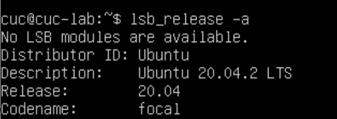

  当前 Linux 内核版本信息

  ```
  //语句
  uname -a
  //结果
  Linux内核版本 5.4.0-65-generic #73-Ubuntu SMP MON JAN 18 
  ```

   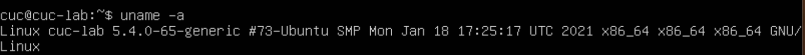
  

##### 2.Virtualbox 安装完 Ubuntu 之后新添加的网卡如何实现系统开机自动启用和自动获取 IP？

1. 查看网卡：

   ```
   ifconfig  //查看正在工作的网卡

   ip a //查看所有网卡
   ```

   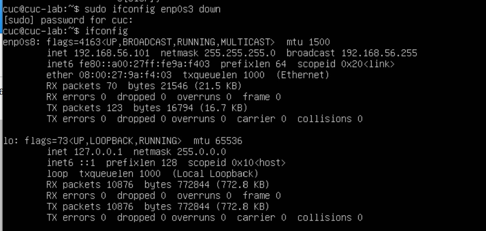

   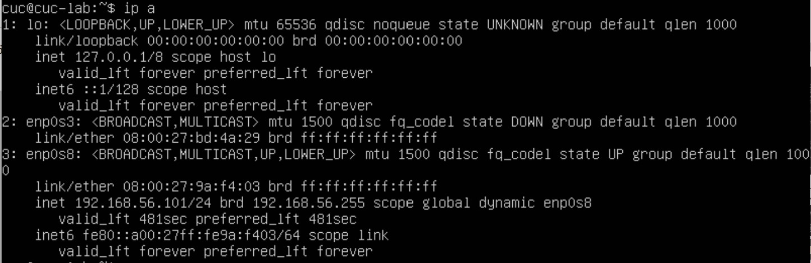
   发现网卡`enp0s3`不在工作中，仅在数据链路层存在，需要在网络层打开
   </br>

2. 实现网络层启用：

   ```
   sudo ifconfig enp0s3 up 

   ifconfig \\进行检查
   ```

   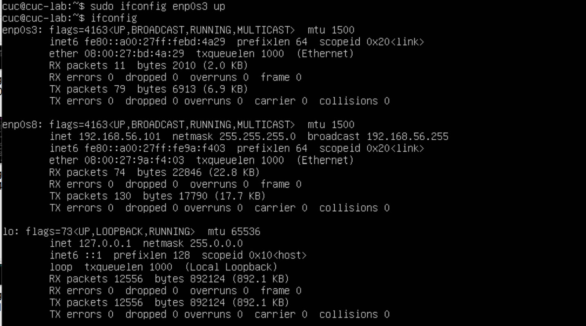

   发现`enp0s3`少了IPv4的地址 配置，下面则需要配置IPv4地址,使用DHCP方式配置
   </br>
   
3. 查找网络配置的文件名：

   ```
   ls /etc/netplan/
   ```

   
   

4. 打开网络配置文件,可以看到没有关于`enp0s3`的`dhcp`地址分配：

   ```
   sudo vi /etc/netplan/00-installer-config.yaml
   ```

   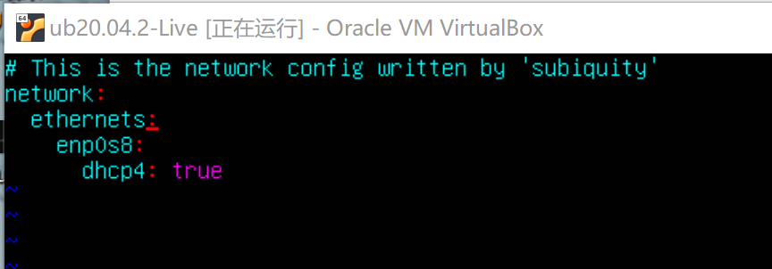
   

5. 进行修改，加上有关`enp0s3`的信息：

   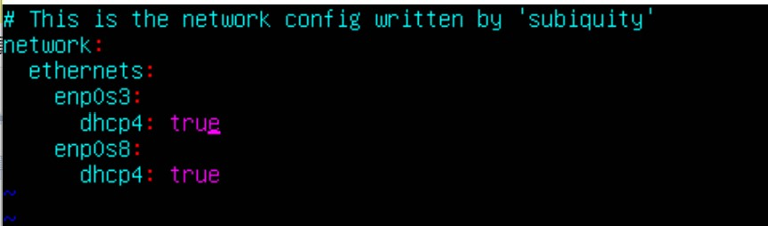


6. 修改完成后保存并退出，执行`sudo netplan apply`，执行新的网络配置文件
</br>

7. 然后执行`ifconfig`,查看是否修改成功，结果如图：

   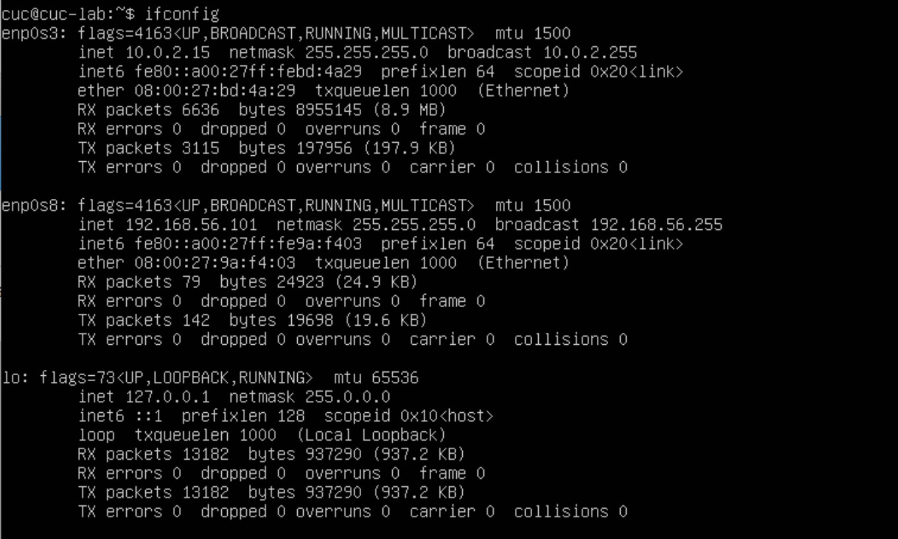

   实验完成
   

##### 3.如何使用 `scp` 在「虚拟机和宿主机之间」、「本机和远程 Linux 系统之间」传输文件？

   ```
   // 语句
   scp [local_file] [remote_username]@[remote_ip]:[remote_folder]
   local_file ：本地文件
   remote_username：远程用户名
   remote_ip：远程机器IP地址
   remote_folder 远程文件
   ```

1. 本地文件text.txt

   

2. 使用`scp`语句，传输文件

   ```
   scp text.tet[文件名（路径）] cuc@192.xxx.xxx.xx[要传输的用户名@IP地址]:/home/cuc/getext.txt[传输到该IP地址处的保存路径及保存的文件名]
   ```

   

3. 在Linux虚拟机进行验证：

   ```
   // ls 文件保存目录
   ls /home/cuc/   
   //xdg-open 文件名   打开文件
   xdg-open getext.txt
   ```

   


##### 4.如何配置 SSH 免密登录？

1. 首先，确保两台主机都打开ssh服务。由于windows10系统cmd无法使用ssh,我是用git bash。

   参考链接 https://blog.csdn.net/liangzc1124/article/details/107442511 具体参考链接

   ```
   1.Linux中使用命令service --status-all | grep ssh查看是否启用ssh
   若服务已经启动的话，可以看到[+] ssh
   若服务还没启动的话，可以看到[-] ssh
   2.启动ssh服务，使用命令sudo service sshd start
   ```

2. 在主机上配置rsa密码钥对：

   ```
   ssh-keygen -t rsa
   ```

   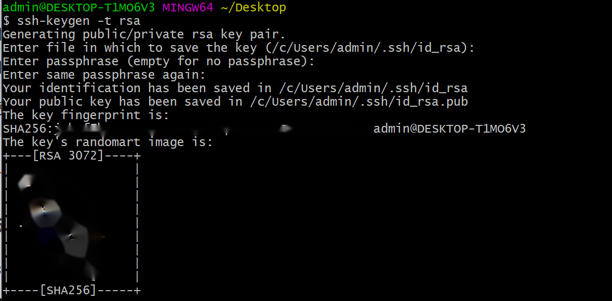

   在`/.ssh`目录下查看产生的公私钥文件，id_rsa 为私钥，id_rsa.pub为公钥

   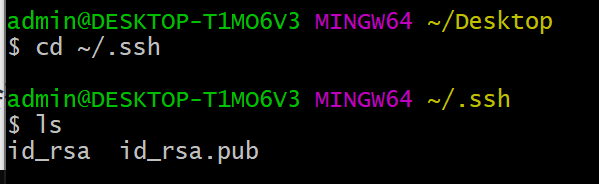

3. 将公钥发送到要登陆的网址上：

   ```
   ssh-copy-id cuc@192.xxxx.xxx.xxx
   ```

   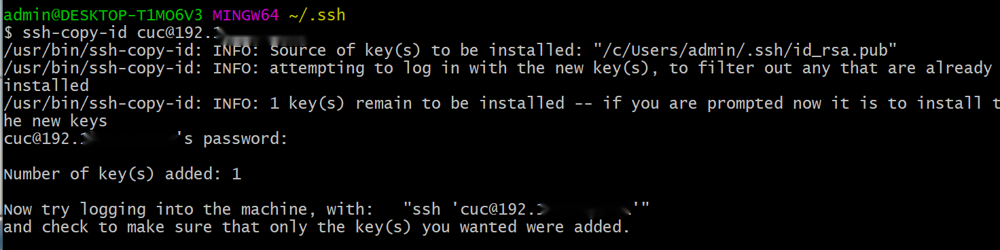

   可以在虚拟机上检查，在`/.ssh`中是否存在公钥文件，存在即可：

   

4. 就可以在主机上，利用`ssh username@ip address`登录：

   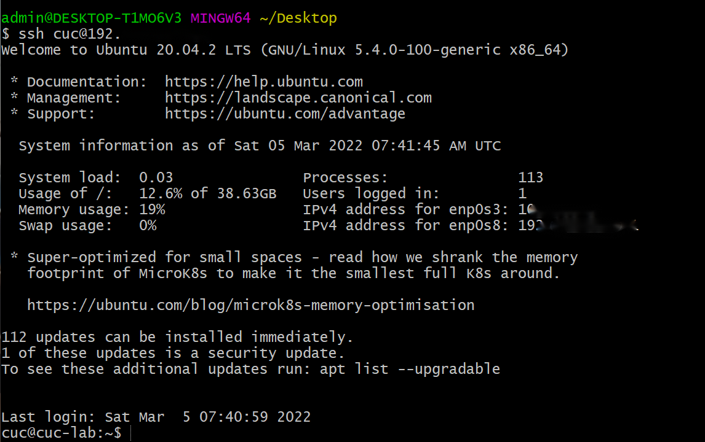

