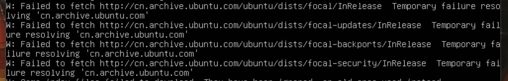
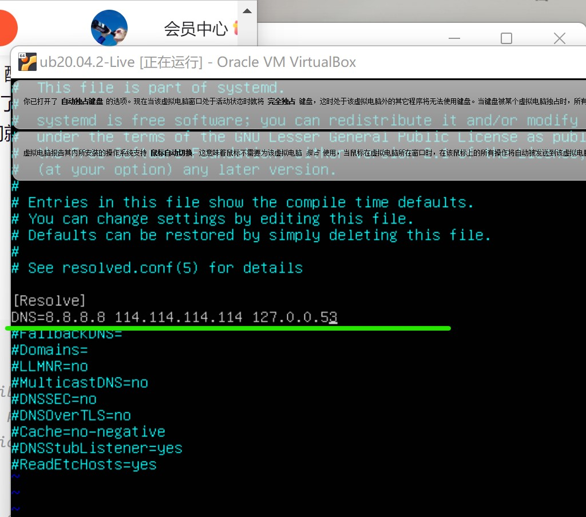

### 实验二

#### Ubuntu20.04

#### 1.【软件包管理】在目标发行版上安装 `tmux` 和 `tshark` ；查看这 2 个软件被安装到哪些路径；卸载 `tshark` ；验证 `tshark` 卸载结果

    ```
    sudo apt install [softname] //安装

    dpkg -L [softname] //查询安装路径

    sudo apt --purge remove [softname] // 卸载软件包
    ```

- 安装`tmux`和`tshark`：

    [tumx_tshark_install](https://asciinema.org/a/477361)
 
- 查看这 2 个软件被安装到哪些路径：

    [install_path_found](https://asciinema.org/a/477362)

- 卸载 `tshark` ，验证 `tshark` 卸载结果：

    [tshark_remove_and_check](https://asciinema.org/a/477363)

 

#### 2.【文件管理】复制以下 `shell` 代码到终端运行，在目标 Linux 发行版系统中构造测试数据集，然后回答以下问题：

- 找到 `/tmp` 目录及其所有子目录下，文件名包含 `666` 的所有文件

 ```
 sudo find / -name "*666*"
 ```

- 找到 `/tmp` 目录及其所有子目录下，文件内容包含 `666` 的所有文件

 ```
 find . | xargs grep "666"
 ```

 [find_and_grep_666](https://asciinema.org/a/477263)


#### 3.【文件压缩与解压缩】练习课件中 [文件压缩与解压缩](https://c4pr1c3.github.io/LinuxSysAdmin/chap0x02.md.html#/12/1) 一节所有提到的压缩与解压缩命令的使用方法

- `gzip` 

 ```
 gzip Filename //压缩
 gzip -d  Filename.gz //解压缩
 ```

 [linx_gzip_d](https://asciinema.org/a/477298)


- `bzip2`

 ```
 bzip2 Filename //压缩
 bungzip2 xxx.bz2 //解压缩
 ```

 [linx_bzip2_bungzip2](https://asciinema.org/a/477301)

- `zip`

 ```
 zip Filename //压缩
 unzip //解压缩
 ```

 [linx_zip_unzip](https://asciinema.org/a/477380)

- `tar`

 ```
 tar -xvf Filename.tar   //解包
 tar -cvf Filename.tar Dirname  //将DirName和其下所有文件（夹）打包
 ```

 [linx_tar](https://asciinema.org/a/477307)

- `pz7zip`

 ```
 7z a -t7z -r manager.7z path //压缩
 7z x manager.7z -r -o path //解压
 ```

 [linx_p7zip](https://asciinema.org/a/477309)


#### 4.【跟练】 [子进程管理实验](https://asciinema.org/a/f3ux5ogwbxwo2q0wxxd0hmn54)

 [linx_follow_1_ping_&](https://asciinema.org/a/478057)

 [linx_follo_2](https://asciinema.org/a/477319)

#### 5.【硬件信息获取】目标系统的 CPU、内存大小、硬盘数量与硬盘容量

- 目标系统的 CPU `cat /proc/cpuinfo `,`| grep -i name`筛选出CPU名称

- 内存大小`cat /proc/meminfo | grep -i size`  

- 硬盘数量、容量`sudo fdisk -l | grep "Disk /dev/"`

 [linx_cpu_and_size_and_disk](https://asciinema.org/a/477357)


#### CentOS

#### 1.【软件包管理】在目标发行版上安装 `tmux` 和 `tshark` ；查看这 2 个软件被安装到哪些路径；卸载 `tshark` ；验证 `tshark` 卸载结果

    ```
    sudo yum install [softname] //安装

    rpm -ql [softname] //查询安装路径

    sudo yum remove [softname] // 卸载软件包
    ```

- 安装`tmux`和`tshark`,由于`CentOS`中没有`tshark`的安装包，需要安装`wireshark`，来实现：

    [cos_tmux_tshark_install](https://asciinema.org/a/477391)
 
- 查看这 2 个软件被安装到哪些路径：

    [cos_path_install_found](https://asciinema.org/a/477393)

- 卸载 `tshark` （即`wiresahrk`），验证卸载结果：


    [cos_tshark_remove_and_check](https://asciinema.org/a/477394)

 

#### 2.【文件管理】复制以下 `shell` 代码到终端运行，在目标 Linux 发行版系统中构造测试数据集，然后回答以下问题：

- 找到 `/tmp` 目录及其所有子目录下，文件名包含 `666` 的所有文件

 ```
 sudo find / -name "*666*"
 ```

- 找到 `/tmp` 目录及其所有子目录下，文件内容包含 `666` 的所有文件

 ```
 find . | xargs grep "666"
 ```

 [cos_find_and_grep_666](https://asciinema.org/a/477415)


#### 3.【文件压缩与解压缩】练习课件中 [文件压缩与解压缩](https://c4pr1c3.github.io/LinuxSysAdmin/chap0x02.md.html#/12/1) 一节所有提到的压缩与解压缩命令的使用方法

- `gzip` 

 ```
 gzip Filename //压缩
 gzip -d  Filename.gz //解压缩
 ```

 [cos_gzip_d](https://asciinema.org/a/477398)


- `bzip2`

 ```
 bzip2 Filename //压缩
 bungzip2 xxx.bz2 //解压缩
 ```

 [cos_bzip2_bungzip2](https://asciinema.org/a/477401)

- `zip`

 ```
 zip Filename //压缩
 unzip //解压缩
 ```

 [cos_zip_unzip](https://asciinema.org/a/477396)

- `tar`

 ```
 tar -xvf Filename.tar   //解包
 tar -cvf Filename.tar Dirname  //将DirName和其下所有文件（夹）打包
 ```

 [cos_tar](https://asciinema.org/a/477402)

-  `p7zip`

 ```
 7z a -t7z -r manager.7z path //压缩
 7z x manager.7z -r -o path //解压
 ```

 [cos_p7zip](https://asciinema.org/a/477405)


#### 4.【跟练】 [子进程管理实验](https://asciinema.org/a/f3ux5ogwbxwo2q0wxxd0hmn54)

 [cos_follow](https://asciinema.org/a/478077)
 
#### 5.【硬件信息获取】目标系统的 CPU、内存大小、硬盘数量与硬盘容量

- 目标系统的 CPU `cat /proc/cpuinfo `,`| grep -i name`筛选出CPU名称

    [cos_cpu_name](https://asciinema.org/a/477411)

- 内存大小`cat /proc/meminfo | grep -i size`  

    [cos_size](https://asciinema.org/a/477412)

- 硬盘数量、容量`sudo fdisk -l | grep "Disk /dev/"`

    [cos_disk_num_size](https://asciinema.org/a/477413)


#### 问题与解决方案

##### 关于`sudo apt update `报错：`Temporary failure resolving "cn.archive.ubuntu.com"`

 在使用`sudo apt update`时，出现了暂时无法解析"cn.archive.ubuntu.com"的错误：

 
 
 首先，使用命令`curl -v www.baidu.com`,向百度网站发起请求，得到的反馈是（这里我没有进行截图）：

 ```
 * Rebuilt URL to: www.baidu.com/
 * Could not resolve host: www.baidu.com
 * Closing connection 0
 curl: (6) Could not resolve host: www.baidu.com
 ```

 解释原因为：没有配置DNS服务器地址，但其实我本地是存在一个原有dns地址的，不知道什么原因没有发挥作用。

 根据所查资料显示：要配置DNS，首先，要修改`/etc/systemd/resolved.conf`: `sudo vi /etc/systemd/resolved.conf`

 将查到的公网用的DNS地址 ：`DNS:8.8.8.8`和`DNS:114.114.114.114`添加进去：

 

 如图，`127.0.0.53`为我原来存在的DNS地址

 第二步，重启域名解析服务：

                systemctl restart systemd-resolved
                systemctl enable systemd-resolved


 第三步：备份当前的`/etc/resolve.conf`，并重新设置`/run/systemd/resolve/resolv.conf`  到`/etc/resolve.conf`的软链接

                mv    /etc/resolv.conf    /etc/resolv.conf.bak
                ln  -s   /run/systemd/resolve/resolv.conf    /etc/

 然后就可以正常启动了。

 【参考资料】

  关于`curl`命令的使用:https://cloud.tencent.com/developer/article/1579118

  关于DNS错误的发现:http://www.manongjc.com/article/34069.html

  关于Ubuntu20.04配置DNS的正确方式：https://blog.csdn.net/lsc_1893/article/details/118696693
