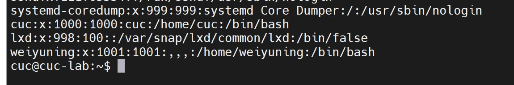

## 实验三：Linux服务器系统管理基础


### 实验目的

- 检验linux服务器系统使用基础相关操作学习成果

### 实验环境

- 宿主机：windows11
- 本机linux系统：ubutun 20.04.03 live-server 64bit

### 实验内容

- [根据Systemd 入门教程：命令篇](http://www.ruanyifeng.com/blog/2016/03/systemd-tutorial-commands.html)完成基本操作 
- [根据Systemd 入门教程：实战篇](http://www.ruanyifeng.com/blog/2016/03/systemd-tutorial-part-two.html)完成相关操作
- 完成自查清单

### 实验过程

#### Systemd入门教程：命令篇

##### 3.1 systemctl

```
# 重启系统
$ sudo systemctl reboot

# 关闭系统，切断电源
$ sudo systemctl poweroff

# CPU停止工作
$ sudo systemctl halt

# 暂停系统
$ sudo systemctl suspend

# 让系统进入冬眠状态
$ sudo systemctl hibernate

# 让系统进入交互式休眠状态
$ sudo systemctl hybrid-sleep

# 启动进入救援状态（单用户状态）
$ sudo systemctl rescue
```

部分操作结果展示：

1.重启系统


2.暂停系统：无法继续输入


[[命令篇3.2 systemd-analyze](https://asciinema.org/a/485907.svg)](https://asciinema.org/a/485907)

[[命令篇3.3 hostnamectl](https://asciinema.org/a/485908.svg)](https://asciinema.org/a/485908)

[[命令篇3.4 localectl](https://asciinema.org/a/485910.svg)](https://asciinema.org/a/485910)

[[命令篇3.5 timedatectl](https://asciinema.org/a/485914.svg)](https://asciinema.org/a/485914)

[[命令篇3.6 loginctl](https://asciinema.org/a/485917.svg)](https://asciinema.org/a/485917)

[[命令篇4.1systemctl list-units](https://asciinema.org/a/485918.svg)](https://asciinema.org/a/485918)

[[命令篇4.2 Unit 的状态-systemctl status](https://asciinema.org/a/485921.svg)](https://asciinema.org/a/485921)

[[命令篇4.2 Unit 的状态-systemctl](https://asciinema.org/a/485922.svg)](https://asciinema.org/a/485922)

[[命令篇4.3 Unit 管理](https://asciinema.org/a/485923.svg)](https://asciinema.org/a/485923)

[[命令篇4.4 依赖关系](https://asciinema.org/a/485924.svg)](https://asciinema.org/a/485924)

[[命令篇5.2 配置文件的状态](https://asciinema.org/a/485926.svg)](https://asciinema.org/a/485926)

[[命令篇5.3 配置文件的格式](https://asciinema.org/a/485927.svg)](https://asciinema.org/a/485927)

[[命令篇6.target](https://asciinema.org/a/485928.svg)](https://asciinema.org/a/485928)

[[命令篇7日志管理-1](https://asciinema.org/a/485930.svg)](https://asciinema.org/a/485930)

[[命令篇7日志管理-2](https://asciinema.org/a/485933.svg)](https://asciinema.org/a/485933)

#### Systemd入门教程：实战篇

[实战篇操作(https://asciinema.org/a/485937.svg)](https://asciinema.org/a/485937)

#### 自查清单

##### 1.如何添加一个用户并使其具备sudo执行程序的权限？

```
#添加一个用户
sudo adduser *Username*
#检查
cat /etc/passwd
#添加sudo权限
sudo usermod -G sudo *Username*
#通过查看用户组信息，检查用户的sudo权限 
cat /etc/group
```
 

 

 

 


##### 2.如何将一个用户添加到一个用户组？

```
sudo addgroup *groupname*  #创建组

sudo adduser *groupname* *username* #添加用户到组

groups *username*  #查看用户属于什么组
```

 


##### 3.如何查看当前系统的分区表和文件系统详细信息？

```
#查看分区表
lsblk
#查看文件系统详细信息
df -T -h
```

 

 


##### 4.如何实现开机自动挂载Virtualbox的共享目录分区？

- 安装客机增强功能

  ```
  sudo mkdir --p /media/cdrom
  sudo mount -t auto /dev/cdrom /media/cdrom/
  cd /media/cdrom/
  sudo sh VBoxLinuxAdditions.run
  ```

  

- 配置固定分配共享文件夹

 


- 挂载

  ```
  sudo mkdir /mnt/share   #新建Ubuntu共享文件夹
  sudo mount -t vboxsf [你的windows共享目录] [Ubuntu共享目录]   #挂载命令
  ```

 


- 实现开机自动挂载

  ```
  sudo vi /etc/systemd/system/mnt-tmp.mount
  #文件内容添加如下：
  [Unit]
  Description=vbox shared dir mount script
  Requires=network-online.target
  After=network-online.service
  
  [Mount]
  # 这里的 ning_text 是在 Virtualbox 共享文件夹设置里指定的 共享文件名称
  What=ning_text
  
  # 这里的 /mnt/share 是挂载目的目录，如果没有，需要事先创建好
  Where=/mnt/share
  
  # 指定挂载文件系统类型
  Type=vboxsf
  
  [Install]
  WantedBy = multi-user.target
  ```
  
  然后创建一个自动挂载类型的 Unit 文件 ： `/etc/systemd/system/mnt-tmp.automount` 文件内容如下
  
  ```
  [Unit]
  Description=vbox shared dir mount script
  Requires=network-online.target
  After=network-online.service
  
  [Automount]
  Where=/mnt/share
  TimeoutIdleSec=10
  
  [Install]
  WantedBy = multi-user.target
  ```
  
  记得保存完上述 Unit 文件之后，执行 `sudo systemctl enable mnt-tmp.automount`。重启系统，验证共享目录自动挂载
  
  [实现共享文件自动挂载(https://asciinema.org/a/485997.svg)](https://asciinema.org/a/485997)


##### 5.基于LVM（逻辑分卷管理）的分区如何实现动态扩容和缩减容量？

```
#扩容
lvextend -L + <容量> <目录> 
#减容
lvreduce -L - <容量> <目录>   
```


##### 6.如何通过systemd设置实现在网络连通时运行一个指定脚本，在网络断开时运行另一个脚本？

```
systemctl cat colord.service  #找到配置文件/lib/systemd/system/colord.service

#对配置文件进行修改
ExecStart=<path_service1> start
ExecStop=<path_service2> stop 

#重新加载并启动该配置文件
```


##### 7.如何通过systemd设置实现一个脚本在任何情况下被杀死之后会立即重新启动？实现***杀不死\***？

```
systemctl cat colord.service  #修改对应的配置文件及路径

#修改配置文件
[Service]
Restart=always

#重新加载并重启
```

[实现“杀不字”操作(https://asciinema.org/a/486006.svg)](https://asciinema.org/a/486006)

#### 参考资料

[Systemd 入门教程：命令篇](http://www.ruanyifeng.com/blog/2016/03/systemd-tutorial-commands.html)

[Systemd 入门教程：实战篇](http://www.ruanyifeng.com/blog/2016/03/systemd-tutorial-part-two.html)

[解决VirtualBox无法安装增强工具_THMAIL的博客-CSDN博客_virtualbox增强功能安装不了](https://blog.csdn.net/THMAIL/article/details/107560777)

[Virtualbox实现共享文件夹并自动挂载_半砖的博客-CSDN博客_virtualbox挂载共享文件夹](https://blog.csdn.net/hexf9632/article/details/93774198)

[师姐评价](https://github.com/CUCCS/2015-linux-public-songyawen/pull/2)

