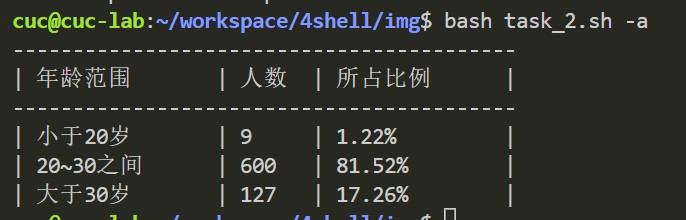
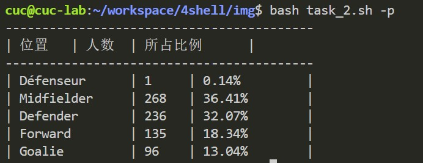
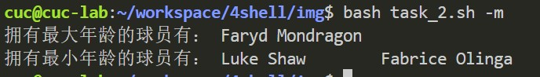
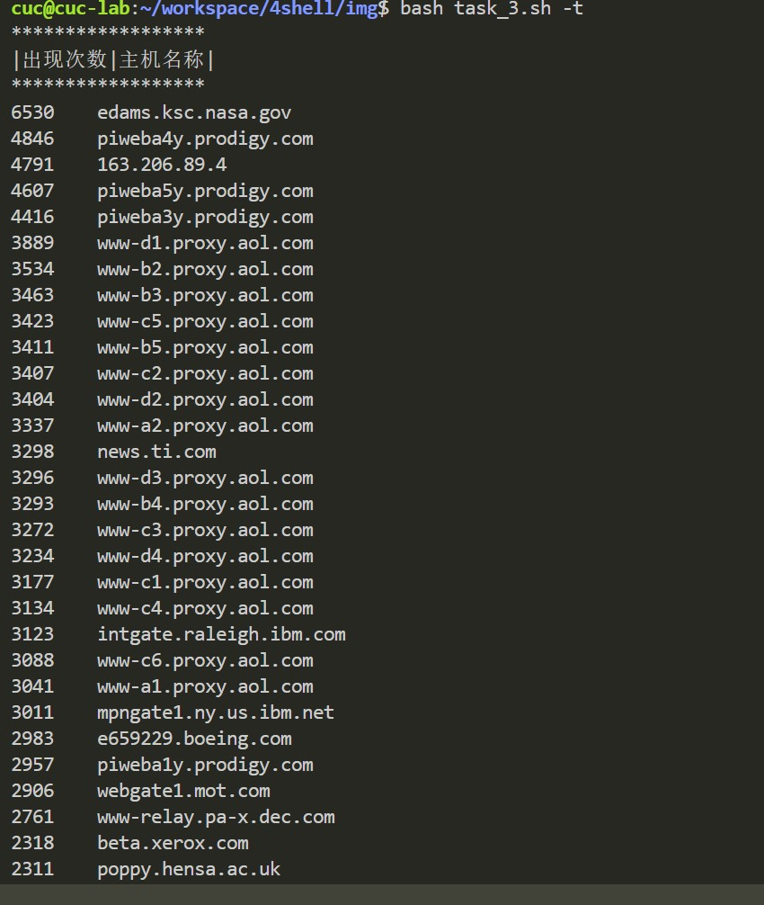
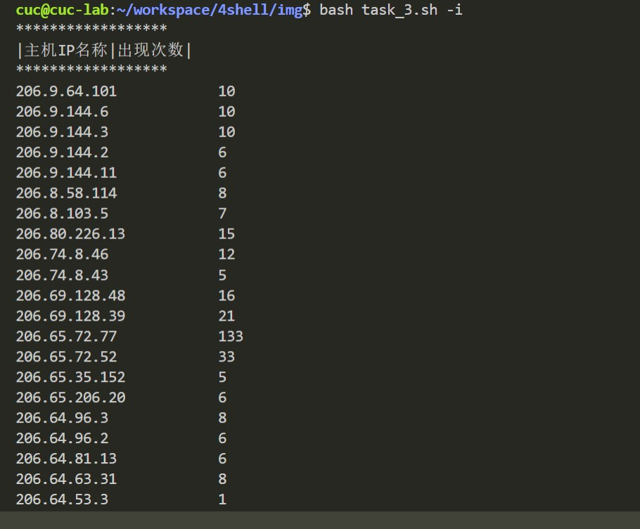
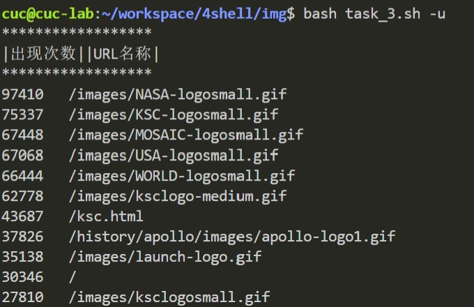
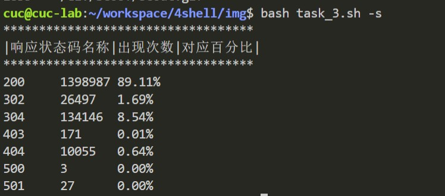
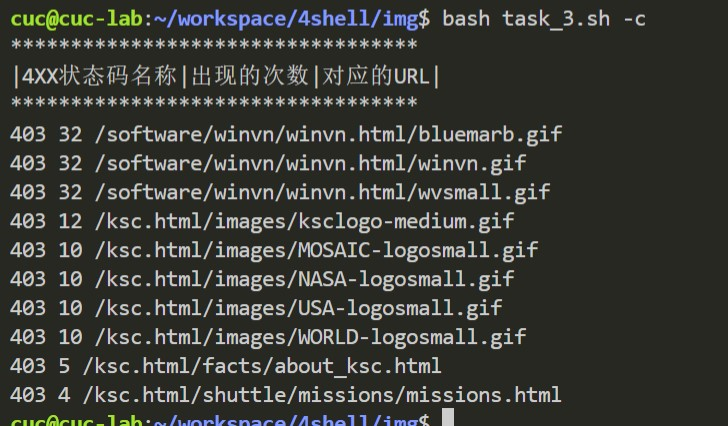
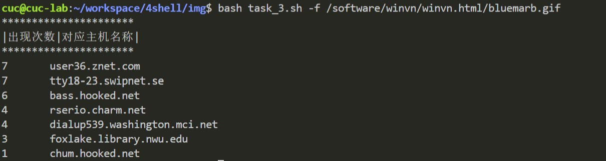

## 实验四：shell脚本编程基础(实验)


### 实验环境

- 宿主机：windows11
- 本机linux系统：ubutun 20.04.03 live-server 64bit
- Bash环境：version 5.0.17(1)-release (x86_64-pc-linux-gnu)

### 实验内容

- [x] 练习：求两个数的最大公因数

- 任务一：用bash编写一个图片批处理脚本，实现以下功能：

  - [x] 支持命令行参数方式使用不同功能 

  - [x] 支持对指定目录下所有支持格式的图片文件进行批处理
  - [x] 支持以下常见图片批处理功能的单独使用或组合使用
    - [x] 支持对jpeg格式图片进行图片质量压缩
    - [x] 支持对jpeg/png格式图片在保持原始宽高比的前提下压缩分辨率
    - [ ] 支持对svg格式图片在保持原始宽高比的前提下压缩分辨率
    - [x] 支持对图片批量添加自定义文本水印
    - [x] 支持批量重命名（统一添加文件名前缀或后缀，不影响原始文件扩展名）
    - [x] 支持将png/svg图片统一转换为jpg格式图片

- 任务二：用bash编写一个文本批处理脚本，对以下附件分别进行批量处理完成相应的数据统计任务：

  - 2014世界杯运动员数据
    - [x] 统计不同年龄区间范围（20岁以下、[20-30]、30岁以上）的球员**数量**、**百分比**
    - [x] 统计不同场上位置的球员**数量**、**百分比**
    - [x] 名字最长的球员是谁？名字最短的球员是谁？（字节、字符统计）
    - [x] 年龄最大的球员是谁？年龄最小的球员是谁？（最可能有多个）
  - Web服务器访问日志
    - [x] 统计访问来源主机TOP 100和分别对应出现的总次数
    - [x] 统计访问来源主机TOP 100 IP和分别对应出现的总次数
    - [x] 统计最频繁被访问的URL TOP 100
    - [x] 统计不同响应状态码的出现次数和对应百分比
    - [x] 分别统计不同4XX状态码对应的TOP 10 URL和对应出现的总次数
    - [x] 给定URL输出TOP 100访问来源主机

  

  ### 实验结果

  - 练习：求两个整数的最大公因数：

    ```shell
    #!/usr/bin/env bash
     # 求两个数的最大公约数，利用辗转相除法，递归算法
    function Greatest_Common_Divisor {
    
        if [[ "$(($1%$2))" -eq 0 ]]; then 
            echo "最大公约数为：$2"
        else 
            Greatest_Common_Divisor "$2" "$(($1%$2))" ;
        fi
    }
    
    
    function isNum {
        if [[ -z "$1" ]]; then
            echo "ERRO: 有空字符，请输入两个整数类型数据！"
            return 1
    
        elif [[ $1 =~ ^[a-zA-Z]+$ ]]; then  #利用正则表达式
            echo "ERRO: $1 是字符类型，请输入两个整数类型数据！"
            return 1
        
        elif [[ $1 =~ ^[0-9]+$ ]]; then
            # expr "$1" + 0 &>/dev/null
            # if [[ $? -ne 0 ]]; then
            #     echo "ERRO: $1 是小数类型，请输入两个整数类型数据！"
            #     return 1
            # else
                return 2
                
        else
            echo "ERRO: 请输入两个整数类型数据！"
            return 1
        fi
    }
    
    
    while [[ "1" -ne "0" ]] 
    do
        echo "请输入两个正整数："
        read -r  a b
        isNum "$a"
        x=$?
        isNum "$b"
        y=$?
        if [ "$x" -eq 2 ]&&[ "$y" -eq 2 ]; then
            Greatest_Common_Divisor "$a" "$b"
            break
        fi
    done
    
    ```
  
    
  
  - 任务一
  
    - 支持命令行参数方式使用不同功能 ：
  
      ```shell
      #利用case语句对输入命令进行判断
      [ $# -eq 0 ] && help
      if [ "$1" != "" ];then #判断命令行要求做什么操作
          case "$1" in
              "-h")
                  help
                  exit 0
                  ;;
              "-c")
                  CompressQuality "$2"
                  exit 0
                  ;;
              "-r")
                  CompressResolution "$2"
                  exit 0
                  ;;
              "-w")
                  WaterMark "$2" "$3" "$4"
                  exit 0
                  ;;
              "-p")
                  AddPrefix "$2"
                  exit 0
                  ;;
              "-s")
                  AddSuffix "$2"
                  exit 0
                  ;;
              "-t")
                  TransformToJpg
                  exit 0
                  ;;
          esac
      fi
      ```
  
    - 支持对jpeg格式图片进行图片质量压缩：
  
      ```shell
      #图片质量压缩，利用convert语句quality参数
      function CompressQuality {
          Q=$1 #质量因子
          echo "${Q}"
          for imge in img/*;do
              type=${imge##*.} #取文件类型
              if [[ "${type}" != "jpeg" ]]; then continue;fi
              convert -quality "${Q}" "${imge}" "${imge}"
              echo "${imge} is Successfully compressed."
          done
      }
      ```
  
    - 支持对jpeg/png格式图片在保持原始宽高比的前提下压缩分辨率：
  
      无法顺利进行svg图片压缩，可能是图片源或者语句问题，没有解决
  
      ```shell
      #图片压缩分辨率
      function CompressResolution {
          T=$1 #格式jpg\svg\png
          W=$2 #指压缩指定宽度
          for imge in img/*;do
              type=${imge##*.}
              if [[ "${type}" == "${T}" ]];then  
                  convert "${imge}" -resize "${W}" "${imge}"
                  echo "${imge} is Successfully compressed."
              elif [[ "${type}" != "${T}" ]];then continue;
              fi
          done 
      }
      ```
  
    - 支持对图片批量添加自定义文本水印：
  
      ```shell
      #对图片批量添加自定义文本水印
      function WaterMark {
          content=$1
          size=$2
          position=$3 
          echo "${content} ${size} ${position}"
          for imge in img/* ;do
              type=${imge##*.}
              if [[ ${type} = "jpg" ||  ${type} = "svg" ||  ${type} = "png" || ${type} = "jpeg" ]]; then
              convert "${imge}" -pointsize "${size}" -fill red -gravity "${position}" -draw "text 10,10 '${content}'" "${imge}"
              fi
              echo "${imge} is watermarked with ${content} successfully ."
          done
      }
      ```
  
    - 支持批量重命名（统一添加文件名前缀或后缀，不影响原始文件扩展名）:
  
      ```shell
      #批量重命名（统一添加文件名前缀，不影响原始文件扩展名）
      function Rename_prefix {
          T="$1"
          for imge in img/*;do
              name=${imge##*/}  #取文件名
              new=img/"${T}${name}"
              mv "${imge}" "${new}"
              echo "${imge} is Successfully renamed to ${T}${name}."
          done
      
      }
      
      #批量重命名（统一添加文件名后缀，不影响原始文件扩展名）
      function Rename_suffix {
          T=$1
          for imge in img/*;do
              type="."${imge##*.} #文件类型
              name=$(basename "${imge}" "${type}") #文件名字
              new=img/"${name}${T}${type}"
              mv "${imge}" "${new}"
              echo "${imge} is Successfully renamed to ${new}."
          done
      }
      
      ```
  
      
  
    - 支持将png/svg图片统一转换为jpg格式图片：
  
      ```shell
      #将png/svg图片统一转换为jpg格式图片 
      function TransformToJpg {
          for imge in img/* ;do
              type=${imge##*.}
              if [[ "${type}" == "png" || "${type}" == "svg" ]]; then
                  new_name=${imge%.*}".jpg"
                  convert "${imge}" "${new_name}"
                  echo "${imge} has transformed into ${new_name}"
              else continue;
              fi
          done
      }
      ```
  
  - 任务二：2014世界杯运动员数据
  
    - 统计不同年龄区间范围（20岁以下、[20-30]、30岁以上）的球员**数量**、**百分比**
  
      ```shell
      function Age {
          awk -F '\t' 'BEGIN {small=0; middle=0; high=0}
          NR>1{
              if($6 < 20) {small++;}
              else if($6 >= 20 && $6 <= 30) {middle++;}
              else {high++;}
          } 
          END{
              total=small+high+middle
              printf("------------------------------------------\n")
              printf("| 年龄范围\t | 人数\t | 所占比例\t | \n")
              printf("------------------------------------------\n")
              printf("| 小于20岁\t | %d\t | %.2f%\t | \n",small,small/total*100);
              printf("| 20~30之间\t | %d\t | %.2f%\t | \n",middle,middle/total*100);
              printf("| 大于30岁\t | %d\t | %.2f%\t | \n",high,high/total*100);
          }
          ' worldcupplayerinfo.tsv
          exit 0
      }
      ```

      
  
      
  
    - 统计不同场上位置的球员**数量**、**百分比**
  
      ```shell
      function Position {
          awk -F '\t' 'BEGIN { total=0 }
          NR>1{
              positions[$5]++;total++;  
          }
          END{
              printf("------------------------------------------\n")
              printf("| 位置\t | 人数\t | 所占比例\t | \n")
              printf("------------------------------------------\n")
              for(position in positions) {
                  printf("| %s\t | %d\t | %.2f%\t | \n",position,positions[position],positions[position]/total*100);
              }
          }' worldcupplayerinfo.tsv
          exit 0
      }
      ```

      
  
  
      
  
    - 名字最长的球员是谁？名字最短的球员是谁？（字节、字符统计）:
  
      ```shell
      function Name {
          awk -F "\t" 'BEGIN {max=0; min=100}
          NR>1{
              len=length($9);
              names[$9]=len;
              max=len>max?len:max;
              min=len<min?len:min;
          }
          END{
              printf("拥有最长名字的球员有： ")
              for(i in names){
                  if(names[i]==max)
                  printf("%s\t",i)
              }
              printf("\n")
              printf("拥有最短名字的球员有： ")
              for(i in names){
                  if(names[i]==min)
                  printf("%s\t",i)
              }
              printf("\n")
          } ' worldcupplayerinfo.tsv
          exit 0
      }
      ```

      
  
  
      
  
    - 年龄最大的球员是谁？年龄最小的球员是谁？（最可能有多个）:
  
      ```shell
      function Ages {
          awk -F "\t" 'BEGIN {max=0; min=100;}
          NR>1{
              ages[$9]=$6;
              max=$6>max?$6:max;
              min=$6<min?$6:min;
          }
          END{
              printf("拥有最大年龄的球员有： ")
              for(i in ages){
                  if(ages[i]==max)
                  printf("%s\t",i)
              }
              printf("\n")
              printf("拥有最小年龄的球员有： ")
              for(i in ages){
                  if(ages[i]==min)
                  printf("%s\t",i)
              }
              printf("\n")
          } ' worldcupplayerinfo.tsv
          exit 0
      }
      ```

      
  
  
  - 任务二：Web服务器访问日志
  
    - 统计访问来源主机TOP 100和分别对应出现的总次数
  
      ```shell
      function CountHost {
          printf "******************\n"
          printf "|出现次数|主机名称|\n"
          printf "******************\n"
          awk -F '\t' '
          NR>1{
              hosts[$1]++;
          }
          END{
              for(host in hosts){
                  printf("%d\t%s\t\n",hosts[host],host)
              }
          }' web_log.tsv | sort -k1 -rg | head -100
          exit 0
      }
      ```

      
  
      
  
    - 统计访问来源主机TOP 100 IP和分别对应出现的总次数
  
      ```shell
      function CountIP {
          printf "******************\n"
          printf "|主机IP名称|出现次数|\n"
          printf "******************\n"
          awk -F '\t' '
          NR>1{
              if(match($1,/^[0-9]{1,3}\.[0-9]{1,3}\.[0-9]{1,3}\.[0-9]{1,3}$/)){
                  hosts[$1]++;
              }
          }
          END{
              for(host in hosts){
                  printf("%s\t\t%d\t\n",host,hosts[host])
              }
          }' web_log.tsv | sort -k1 -rg | head -100
          exit 0
      }
      ```

      
  
  
      
  
    - 统计最频繁被访问的URL TOP 100
  
      ```shell
      function MostFrequent {
          printf "******************\n"
          printf "|出现次数||URL名称|\n"
          printf "******************\n"
          awk -F '\t' '
          NR>1{
              urls[$5]++;
          }
          END{
              for(url in urls){
                  printf("%d\t%s\t\t\n",urls[url],url)
              }
          }
          ' web_log.tsv | sort -k1 -rg | head -100
          exit 0
      }
      ```

      
  
      
  
    - 统计不同响应状态码的出现次数和对应百分比
  
      ```shell
      function CountState {
          printf "***********************************\n"
          printf "|响应状态码名称|出现次数|对应百分比|\n"
          printf "***********************************\n"
          awk -F '\t' 'BEGIN { total=0;}
          NR>1{
              response[$6]++;
              total++;
          }
          END{
              for(rep in response){
                  printf("%s\t%d\t%.2f%\t\n",rep,response[rep],response[rep]/total*100)
              }
          }
          ' web_log.tsv
          exit 0
      }
      ```

      
  
      
  
    - 分别统计不同4XX状态码对应的TOP 10 URL和对应出现的总次数
  
      ```shell
      function Count4XX {
          printf "**********************************\n"
          printf "|4XX状态码名称|出现的次数|对应的URL|\n"
          printf "**********************************\n"
          awk -F '\t' '
          NR>1{
              if(match($6,/^4[0-9]{2}$/)){
                  response[$6][$5]++;
              }
          }
          END{
              for(resp in response){
                  for(url in response[resp]){
                          print resp,response[resp][url],url;
                  }
              }
          }' web_log.tsv | sort -k1,1 -k2,2gr | head -10
          exit 0
      }
      ```

      
  
      
  
    - 给定URL输出TOP 100访问来源主机
  
      ```shell
      function Count4XX {
          printf "**********************************\n"
          printf "|4XX状态码名称|出现的次数|对应的URL|\n"
          printf "**********************************\n"
          awk -F '\t' '
          NR>1{
              if(match($6,/^4[0-9]{2}$/)){
                  response[$6][$5]++;
              }
          }
          END{
              for(resp in response){
                  for(url in response[resp]){
                          print resp,response[resp][url],url;
                  }
              }
          }' web_log.tsv | sort -k1,1 -k2,2gr | head -10
          exit 0
      }
      ```

      
  
  ### 实验总结
  
  - ` shell`语句的学习运用，以及`convert`语句各种参数的学习运用
  
    ```
    covert 
    	-quality *质量压缩因子* $file $new_file 质量压缩
    	-resize ** $file $new_file
    ```
  
    
  
  - `awk`相关学习
  
    ```shell
    -F ""  #以什么符号为分隔符
    NR #表示文件中的一行
    match #匹配格式，eg：match($6,/^4[0-9]{2}$/
    sort  #排序
    head -num #取前几名
    arry[] #数组：[]内可以直接用某一个对像，不一定是数字代表
    ```
  
    
  
  ### 参考资料
  
  任务一：
  
  [Linux 中shell脚本通过参数来执行不同的功能_棣文软件的技术博客_51CTO博客](https://blog.51cto.com/divinesoft/1068402)
  
  [(24条消息) Shell脚本：命令选项参数处理__Hansen_的博客-CSDN博客_shell脚本选项参数](https://blog.csdn.net/hanlizhong85/article/details/78008845)
  
  [(24条消息) shell脚本（一）批量修改图片名称_芝麻芝麻哼的博客-CSDN博客_批量修改照片名称脚本](https://blog.csdn.net/u014249958/article/details/73932888)
  
  [(24条消息) linux强大的convert命令(可以对图像做各种处理！)_wonengguwozai的博客-CSDN博客](https://blog.csdn.net/wonengguwozai/article/details/53122629)
  
  
  
  任务二：
  
  [借鉴作业：CUCCS/2021-linux-public-AltSuperBlade (github.com)](https://github.com/CUCCS/2021-linux-public-AltSuperBlade/pull/4/commits/7e87a7bd352bcea1c43337d761b3dbd6db394972)
  
  [(24条消息) shell脚本--awk的用法_wdz306ling的博客-CSDN博客_shell脚本awk用法](https://blog.csdn.net/wdz306ling/article/details/80383824)
  
  [(24条消息) shell脚本中awk应用，数组的定义使用_wztOvO的博客-CSDN博客_awk 定义数组](https://blog.csdn.net/qq_52194329/article/details/112686577)
  
  [(24条消息) Linux shell字符串截取、替换、删除以及trim_aabond的博客-CSDN博客_linux 字符串trim](https://blog.csdn.net/qq_23091073/article/details/83066518)