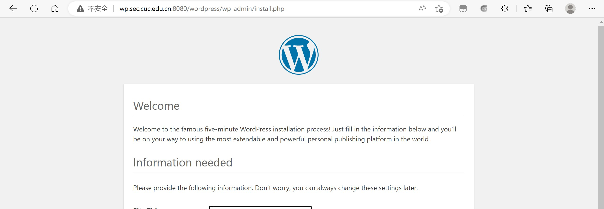

## 实验五：Web服务器

### 实验环境

- ubuntu 20.04.2 LTS
- Windows 11
- Nginx 1.18.0-0ubuntu 1.3
- VeryNginx
- Wordpress
- Damn Vulnerable Web Application (DVWA) v1.10
- PHP v7.4

### 实验要求

#### 基本要求

- [x] 在一台主机（虚拟机）上同时配置 Nginx 和 VeryNginx
  - [x]  VeryNginx 作为本次实验的 Web App 的反向代理服务器和 WAF
  - [x] PHP-FPM 进程的反向代理配置在 nginx 服务器上，VeryNginx 服务器不直接配置 Web 站点服务

- [x] 使用 [Wordpress](https://wordpress.org/) 搭建的站点对外提供访问的地址为[http://wp.sec.cuc.edu.cn](http://wp.sec.cuc.edu.cn/)
- [x] 使用 [Damn Vulnerable Web Application (DVWA)](http://www.dvwa.co.uk/) 搭建的站点对外提供访问的地址为： [http://dvwa.sec.cuc.edu.cn](http://dvwa.sec.cuc.edu.cn/)

#### 安全加固要求

- [x] 使用IP地址方式均无法访问上述任意站点，并向访客展示自定义的**友好错误提示信息页面 -1**
- [x] [Damn Vulnerable Web Application (DVWA)](http://www.dvwa.co.uk/) 只允许白名单上的访客来源IP，其他来源的IP访问均向访客展示自定义的**友好错误提示信息页面 -2**
- [x] 在不升级 Wordpress 版本的情况下，通过定制 [VeryNginx](https://github.com/alexazhou/VeryNginx) 的访问控制策略规则，**热**修复 [WordPress < 4.7.1 - Username Enumeration](https://www.exploit-db.com/exploits/41497/)
- [ ] 通过配置 [VeryNginx](https://github.com/alexazhou/VeryNginx) 的 Filter 规则实现对 [Damn Vulnerable Web Application (DVWA)](http://www.dvwa.co.uk/) 的 SQL 注入实验在低安全等级条件下进行防护

#### VeryNginx 配置要求

- [x] [VeryNginx](https://github.com/alexazhou/VeryNginx) 的 Web 管理页面仅允许白名单上的访客来源 IP，其他来源的 IP 访问均向访客展示自定义的**友好错误提示信息页面 -3**
- [x] 通过定制 VeryNginx 的访问控制策略规则实现：
  - [x] 限制 DVWA 站点的单 IP 访问速率为每秒请求数 < 50
  - [x] 限制 Wordpress 站点的单 IP 访问速率为每秒请求数 < 20
  - [x] 超过访问频率限制的请求直接返回自定义**错误提示信息页面 -4**
  - [x] 禁止 curl 访问

### 实验过程

#### 1 软件安装

##### 1.1 安装Nginx

```bash
sudo apt update && sudo apt install nginx -y
```

##### 1.2 安装VeryNginx

```bash
#克隆VeryNginx仓库
git clone https://github.com/alexazhou/VeryNginx.git

#安装相关依赖包
sudo apt-get install libssl-dev -y
sudo apt install libpcre3 libpcre3-dev -y
sudo apt install build-essential -y
sudo apt install zlib1g-dev -y
sudo apt install gcc -y
sudo apt install make -y

#进入仓库
cd VeryNginx

#先关闭nginx
sudo nginx -s stop

sudo python3 install.py install
```

##### 1.3 安装PHP

```bash
#安装PHP
sudo apt install php-fpm php-mysql php-curl php-gd php-intl php-mbstring php-soap php-xml php-xmlrpc php-zip -y

#重新启动 PHP-FPM 进程
sudo systemctl restart php7.4-fpm
```

##### 1.4安装MySQL

```bash
sudo apt install mysql-server -y 
```

##### 1.5下载安装WordPress

```bash
# 下载安装包
sudo wget https://wordpress.org/wordpress-4.7.zip

# 解压
sudo apt install p7zip-full -y
7z x wordpress-4.7.zip

#建立目录
sudo mkdir /var/www/html/wp.sec.cuc.edu.cn

# 将解压后的wordpress移至指定路径
sudo cp -r wordpress /var/www/html/wp.sec.cuc.edu.cn

#修改文件名，在目录/var/www/html/wp.sec.cuc.edu.cn/wordpress/
sudo mv wp-config-sample.php wp-config.php
```

##### 1.6下载DVWA

```bash
# 下载
git clone https://github.com/digininja/DVWA.git

# 建立目录
sudo mkdir /var/www/html/dvwa.sec.cuc.edu.cn

# 将DVWA移到刚刚创建的目录下
sudo mv DVWA/* /var/www/html/dvwa.sec.cuc.edu.cn
```

#### 2 配置环境

##### 2.1 监听端口号的配置

| 网站      | 端口号 |
| --------- | ------ |
| VeryNginx | 8081   |
| Wordpress | 8080   |
| DVWA      | 8088   |
| Nginx     | 80     |

##### 2.2更改主机配置文件

```bash
192.168.56.101 vn.sec.cuc.edu.cn
192.168.56.101 dvwa.sec.cuc.edu.cn
192.168.56.101 wp.sec.cuc.edu.cn

#Ubuntu 下修改 hosts 文件
sudo vim /etc/hosts

#修改 hosts 文件(管理员权限)
notepad C:\Windows\System32\drivers\etc\hosts
```

 

 


#### 2.3 Nginx配置

- 配置文件

  ```bash
  sudo vim /etc/nginx/sites-enabled/default
  
  ###加入以下内容
  root /var/www/html/wp.sec.cuc.edu.cn;
  # Add index.php to the list if you are using PHP
  
  index index.html index.php;
  
  location ~ \.php$ {
                include snippets/fastcgi-php.conf;
        #       # With php-fpm (or other unix sockets):
                fastcgi_pass unix:/var/run/php/php7.4-fpm.sock;
                fastcgi_param SCRIPT_FILENAME #   #  #$document_root$fastcgi_script_name;
                 include fastcgi_params;
        #       # With php-cgi (or other tcp sockets):
        #       fastcgi_pass 127.0.0.1:9000;
  
  ```

#### 2.4 WordPress配置

- 在MySQL中创建数据库用于wordpress

  ```bash
  create database wordpress DEFAULT CHARACTER SET utf8 COLLATE utf8_unicode_ci;
  
  # 创建用户
  create user 'wp_wyn'@'localhost' IDENTIFIED BY 'cuc123';
  
  #授权
  grant all on wordpress.* to 'wp_wyn'@'localhost';
  
  #刷新并退出
  flush privileges;
  exit;
  
  #重启mysql
  sudo systemctl restart mysql.service 
  ```

- 修改配置文件

  ```bash
  #把目录wordpress的所有权分配给用户和组。
  sudo chown -R www-data:www-data /var/www/html/wp.sec.cuc.edu.cn/wordpress
  
  sudo vim /var/www/html/wp.sec.cuc.edu.cn/wordpress/wp-config.php
  
  #修改相关配置
  // ** MySQL settings - You can get this info from your web host ** //
  /** The name of the database for WordPress */
  define('DB_NAME', 'wordpress');
  /** MySQL database username */
  define('DB_USER', 'wp_wyn');
  /** MySQL database password */
  define('DB_PASSWORD', 'cuc123');
  /** MySQL hostname */
  define('DB_HOST', 'localhost');
  /** Database Charset to use in creating database tables. */
  define('DB_CHARSET', 'utf8');
  /** The Database Collate type. Don't change this if in doubt. */
  define('DB_COLLATE', '');
  ```

  创建新的配置文件，在`/etc/nginx/sites-enabled`下创建`wp.sec.cuc.edu.cn`，并用以下内容配置：

  ```bash
  server {
      listen 8080 default_server;
      listen [::]:8080 default_server;
  
      root /var/www/html/wp.sec.cuc.edu.cn;
      index index.php index.html index.htm index.nginx-debian.html;
      server_name wp.sec.cuc.edu.cn;
  
      location / {
          #try_files $uri $uri/ =404;
          try_files $uri $uri/ /index.php$is_args$args;
      }
  
      location ~ \.php$ {
          include snippets/fastcgi-php.conf;
          fastcgi_pass unix:/var/run/php/php7.4-fpm.sock;
      }
  
      location ~ /\.ht {
          deny all;
      }
  }
  ```

  建立与配置文件的软链接，取消默认的链接关系：

  ```bash
  #创建从新服务器块配置文件到/etc/nginx/sites-enabled/目录的符号链接
  sudo ln -s /etc/nginx/sites-available/wp.sec.cuc.edu.cn /etc/nginx/sites-enabled/
  
  #取消链接默认配置文件
  sudo unlink /etc/nginx/sites-enabled/default
  ```

  ```bash
  # 检查nginx是否成功运行并重启
  sudo nginx -t
  systemctl restart nginx.service
  ```

  

- 访问页面： http://wp.sec.cuc.edu.cn:8080/wordpress/ 

  

#### 2.5 VeryNginx配置

- 修改配置文件

  ```bash
  sudo vim /opt/verynginx/openresty/nginx/conf/nginx.conf
  
  #修改用户名和监听端口号
  user  www-data;
  ...
  http {
    ...
      server {
          listen       8081;
  ...
      }
  }
  ```

- 重启ufw服务，查看配置是否生效

  ```bash
  #重启
  systemctl restart ufw
  
  sudo ufw status
  ```

- 启动VeryNginx服务，登录网址查看管理面板，用户名和密码默认都是 verynginx

  ```bash
  #启动服务
  /opt/verynginx/openresty/nginx/sbin/nginx
  
  #停止服务
  /opt/verynginx/openresty/nginx/sbin/nginx -s stop
  
  #重启服务
  /opt/verynginx/openresty/nginx/sbin/nginx -s reload
  ```

- 访问网址：http://192.168.56.101/verynginx/index.html

#### 2.6 DVWA配置

- 在mysql上新建数据库用于dvwa

  ```bash
  # 启动MySQL
  sudo mysql
  
  # 新建 dvwa 数据库
  create database dvwa default character set utf8 collate utf8_unicode_ci;
  
  # 创建用户
  CREATE USER 'dvwa_wyn'@'localhost' IDENTIFIED BY 'cuc123';
  
  # 授权
  grant all on dvwa.* to 'dvwa_wyn'@'localhost';
  
  #刷新并退出
  flush privileges;
  exit;
  
  # 重启mysql使配置文件生效
  sudo systemctl restart mysql.service 
  ```

- 修改权限

  ```bash
  #授权给www-data用户和组
  sudo chown -R www-data.www-data /var/www/html/dvwa.sec.cuc.edu.cn
  
  # 将/var/www/html/dvwa.sec.cuc.edu.cn/config/目录下的config.inc.php.dist文件改名为config.inc.php
  cd /var/www/html/dvwa.sec.cuc.edu.cn/config/
  sudo mv config.inc.php.dist config.inc.php
  ```

- 修改配置文件

  ```bash
  sudo vim /var/www/html/dvwa.sec.cuc.edu.cn/config/config.inc.php
  
  #修改相关配置
  // ** MySQL settings - You can get this info from your web host ** //
  /** The name of the database for WordPress */
  define('DB_NAME', 'wordpress');
  /** MySQL database username */
  define('DB_USER', 'wp_wyn');
  /** MySQL database password */
  define('DB_PASSWORD', 'cuc123');
  /** MySQL hostname */
  define('DB_HOST', 'localhost');
  /** Database Charset to use in creating database tables. */
  define('DB_CHARSET', 'utf8');
  /** The Database Collate type. Don't change this if in doubt. */
  define('DB_COLLATE', '');
  ```

  创建新的配置文件，在`/etc/nginx/sites-enabled`下创建`dvwa.sec.cuc.edu.cn`，并用以下内容配置：

  ```bash
  sudo vim /etc/nginx/sites-available/dvwa.sec.cuc.edu.cn
  
  # 写入
  server {
      listen 8088 default_server;
      listen [::]:8088 default_server;
  	
      root /var/www/html/dvwa.sec.cuc.edu.cn;
      index index.php index.html index.htm index.nginx-debian.html;
      server_name dvwa.sec.cuc.edu.cn;
  
      location / {
          #try_files $uri $uri/ =404;
          try_files $uri $uri/ /index.php$is_args$args;  
      }
  
      location ~ \.php$ {
          include snippets/fastcgi-php.conf;
          fastcgi_pass unix:/var/run/php/php7.4-fpm.sock;
      }
  
      location ~ /\.ht {
          deny all;
      }
  }
  ```

  ```bash
  # 检查nginx是否成功运行并重启
  sudo nginx -t
  systemctl restart nginx.service
  ```

-  访问链接：http://dvwa.sec.cuc.edu.cn:8088/

  

  根据提示信息对PHP服务进行配置：

  ```bash
  # 修改 php-fpm 文件
  sudo vim /etc/php/7.4/fpm/php.ini 
  #修改状态
  allow_url_include: On
  #重启 php 服务
  systemctl restart php7.4-fpm.service
  ```

  

#### 3.基本要求：VeryNginx反向代理WordPress和DVMA

- 根据参考文档，配置如下图：

  

  

#### 4.安全加固要求

- 使用IP地址方式均无法访问上述任意站点，并向访客展示自定义的**友好错误提示信息页面 -1**

  

  

- [x] [Damn Vulnerable Web Application (DVWA)](http://www.dvwa.co.uk/) 只允许白名单上的访客来源IP，其他来源的IP访问均向访客展示自定义的**友好错误提示信息页面 -2**

  

  

- [x] 在不升级 Wordpress 版本的情况下，通过定制 [VeryNginx](https://github.com/alexazhou/VeryNginx) 的访问控制策略规则，热修复 [WordPress < 4.7.1 - Username Enumeration](https://www.exploit-db.com/exploits/41497/)

  

  

  

- [x] 通过配置 [VeryNginx](https://github.com/alexazhou/VeryNginx) 的 Filter 规则实现对 [Damn Vulnerable Web Application (DVWA)](http://www.dvwa.co.uk/) 的 SQL 注入实验在低安全等级条件下进行防护

  

#### 5.VeryNginx要求

- [VeryNginx](https://github.com/alexazhou/VeryNginx) 的 Web 管理页面仅允许白名单上的访客来源 IP，其他来源的 IP 访问均向访客展示自定义的**友好错误提示信息页面 -3**

 

 

 

- 通过定制 VeryNginx 的访问控制策略规则实现：

  - 限制 DVWA 站点的单 IP 访问速率为每秒请求数 < 50

  - 限制 Wordpress 站点的单 IP 访问速率为每秒请求数 < 20

  - 超过访问频率限制的请求直接返回自定义**错误提示信息页面 -4**

 

 

 

- 禁止 curl 访问

 

 
 
#### 参考资料

- [ubuntu20.04安装VeryNginx ](https://www.jianshu.com/p/6c9c38898b48)
- [VeryNginx文档](https://github.com/alexazhou/VeryNginx/blob/master/readme_zh.md)
- [excuses0217参考](https://github.com/CUCCS/2022-linux-public-excuses0217)